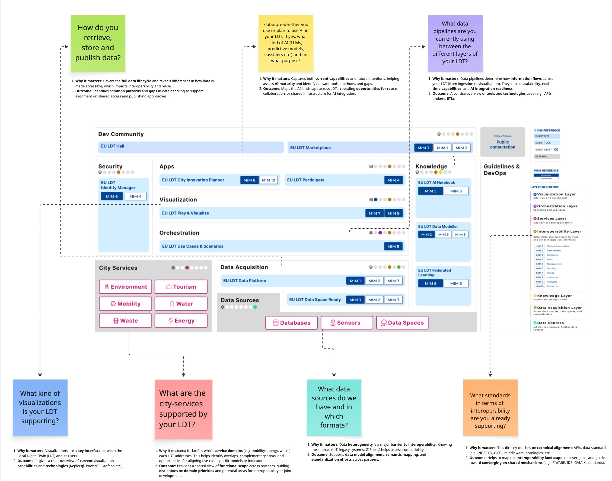

# Towards AI-ready & interoperable LDTs

Local Digital Twins (LDTs) are at the forefront of transforming how cities and communities leverage data and technology to address complex challenges. As the demand for AI-ready and interoperable systems grows, it becomes imperative to establish a unified approach that ensures seamless integration and collaboration across diverse LDT environments. This section introduces the collective efforts and strategic vision aimed at achieving this goal, setting the stage for the technical and strategic objectives outlined below. By fostering interoperability and aligning with open standards, we pave the way for scalable, sustainable, and innovative solutions that benefit both local and European-wide initiatives.

## Strategic Goals
- Assess Cross-Site Interoperability: Evaluate the feasibility and value of enhancing interoperability among LDTs across TEF sites
- Evolve LDTs: Recommend improvements to LDTs and explore common cross-site infrastructure (e.g., data spaces, AI model repositories)
- Define Joint Pilots: Identify and test pilots to validate proposed ideas in real-world scenarios

## Technical Goals
- Aligning with the EU LDT Toolbox, FIWARE and open standards like ETSI NGSI-LD
- Ensuring LDTs can seamlessly integrate AI models by providing structured, standardized, and accessible data
- Develop a “blueprint” for interoperable LDTs across TEF sites
- Identifying and standardizing thematic datasets to enable seamless cross-site data exchange
- Applying MIMs and best practices to ensure scalability and sustainability.

To facilitate collaboration and drive progress towards these goals, we established the LDT Club—a dedicated forum where stakeholders can share insights, align strategies, and collectively address challenges. This collaborative platform serves as a cornerstone for fostering innovation and ensuring that the transition to AI-ready and interoperable LDTs is both inclusive and effective.

Meeting minutes, recordings and further materials related to the LDT Club are available under https://imecinternational.sharepoint.com/:f:/r/sites/Citcom.aiTEF/Shared%20Documents/WP3%20-%20Infrastructure/T3.2/LDT%20Club?csf=1&web=1&e=zyhvcL.

## Scenario: CitCom.AI – EDIC LDT - CitiVerse

The scenario illustrated in the diagram above puts the LDT CitiVerse EDIC and CitCom.AI TEF sites in relation. While the EDIC aims at creating a federated network of Local Digital Twins (LDTs) across Europe, CitCom.AI leverages LDTs to test and integrate AI solutions, fostering innovation in Smart Cities and Communities.\
AI innovators begin by collaborating with CitCom.AI TEF sites, where they can access real-world LDT environments to develop, test, and validate their AI solutions. Ideally, these environments should provide standardized, interoperable data and infrastructure aligned with EU LDT Toolbox guidelines.\
Once solutions are successfully demonstrated within CitCom.AI, innovators can leverage the established interoperability and best practices to integrate their solutions into the broader EDIC federated LDT network. This pathway ensures that innovations are not only tested in realistic scenarios but are also ready for seamless adoption and scaling across multiple European cities and communities through the EDIC framework.\
To ensure interoperability, the CitCom.AI LDTs, currently a set of heterogeneous and independent systems, should adopt common standards and frameworks outlined in the EU LDT Toolbox. This includes aligning data models, APIs, and communication protocols to enable seamless integration and collaboration across the EDIC federated LDT network.\
Conducting a gap analysis between CitCom.AI LDTs and the EU LDT Toolbox is crucial to identify areas where alignment is needed. This analysis will help pinpoint discrepancies in data models, APIs, and communication protocols, ensuring that AI solutions tested within CitComAI can transition seamlessly to the EDIC federated network. By addressing these gaps, the pathway for AI innovators to scale their solutions across Europe becomes more efficient and less fragmented.\

## How to start with a gap analysis?

The diagram above illustrates the different layers and tools of the EU LDT Toolbox. Each sticky note at the border of the  diagram links a question about your existing LDT with the relevant layer of the EU LDT Toolbox. Answering these questions provides a structured starting point for further elaboration of a gap analysis, helping to identify areas where alignment with the toolbox is needed.

Starting from the bottom to the top layer, the following questions help structure your gap analysis. Each question is paired with its rationale and expected outcome to guide your assessment:

**Layer:** Data Sources  
**Question:** What data sources do we have and in which formats?  
**Why it matters:** Data heterogeneity is a major barrier to interoperability. Knowing the sources (IoT, legacy systems, GIS, etc.) helps assess compatibility.  
**Outcome:** Supports data model alignment, semantic mapping, and standardization efforts across partners.

**Layer:** Interoperability Layer  
**Question:** What standards in terms of interoperability are you already supporting?  
**Why it matters:** This directly touches on technical alignment: APIs, data standards (e.g., NGSI-LD, OGC), middleware, ontologies, etc.  
**Outcome:** Helps to map the interoperability landscape, uncover gaps, and guide toward converging on shared mechanisms (e.g., FIWARE, IDS, GAIA-X standards).

**Layer:** Data Acquisition  
**Question:** How do you retrieve, store and publish data?  
**Why it matters:** Covers the full data lifecycle and reveals differences in how data is made accessible, which impacts interoperability and reuse.  
**Outcome:** Identifies common patterns and gaps in data handling to support alignment on shared access and publishing approaches.

**Layer:** Knowledge  
**Question:** Elaborate whether you use or plan to use AI in your LDT. If yes, what kind of AI (LLMs, predictive models, classifiers etc.) and for what purpose?  
**Why it matters:** Captures both current capabilities and future intentions, helping assess AI maturity and identify relevant tools, methods, and gaps.  
**Outcome:** Maps the AI landscape across LDTs, revealing opportunities for reuse, collaboration, or shared infrastructure for AI integration.

**Layer:** Orchestration  
**Question:** What data pipelines are you currently using between the different layers of your LDT?  
**Why it matters:** It clarifies which service domains each LDT targets, helping identify overlaps, complementary focus areas, and opportunities for aligning use-case-specific models or indicators.  
**Outcome:** Provides a shared view of functional scope across partners, guiding discussions on domain priorities and potential areas for interoperability or joint development.

**Layer:** Visualization  
**Question:** What kind of visualizations is your LDT supporting?  
**Why it matters:** Visualizations are a key interface between the Local Digital Twin (LDT) and its users.  
**Outcome:** It gives a clear overview of current visualization capabilities and technologies (Kepler.gl, PowerBI, Grafana etc.).

## Lux TEF LDT For Electromobility​ - Answers

**Q:** What data sources do we have and in which formats?  
**A:** We  deal with data about energy consumption and production. The data comes from simulation engines, REST APIs, or historical datasets. The data format is mainly JSON.  

**Q:** What standards in terms of  interoperability are you already supporting?  
**A:** Our architecture is based on custom micro services and Azure components. Communication happens mainly via REST APIs (documented using OpenAPI 3.0) or Azure Event Grid. Since we are relying on Azure DT  our digital twin model is based on DTDL v3. For any geospatial data we rely on GeoJSON.  

**Q** How do you retrieve, store and publish data?  
**A:** Entities and their relationships are stored in a Neo4j graph database, while telemetry data is kept as timeseries in InfluxDB. We also use Minio (S3) as a kind of staging storage. However, this data is not yet published.  

**Q:** Elaborate whether you use or plan to use AI in your LDT. If yes, what kind of AI (LLMs, predictive models, classifiers etc.) and for what purpose?  
**A:** A user can define scenario/new entities parameters to trigger the generation of synthetic (simulations) or forecasting (deep learning) data. Several purposes: what-if scenarios, forecasting, anomalies detection etc. Results stored in MinIO or InfluxDB and then used for new graphs/entities.  

**Q:** What data pipelines are you currently using between the different layers of your LDT? 
**A:** We have various data pipelines that transform e.g. source data into graph entities and telemetry. Those pipelines are YAML declarations, interpreter and executed by RedPanda Connect (formerly benthos). A dedicated micro service allows to us orchestrate such pipelines.  

**Q:** What kind of visualizations is your LDT supporting?
**A:** All visualizations are integrated in a single LDT front-end. A mapbox based visualization shows the relevant entities (buildings with PVs, charging stations and POIs)  on a geographical map. Chart.js based graphs are built according to city's needs, they can be grouped into a dashboard. Separation of real/historical telemetries and generated one.  

## Aarhus City Lab / Denmark TEF - BIPED Digital Twin​ - Answers

[TBD]