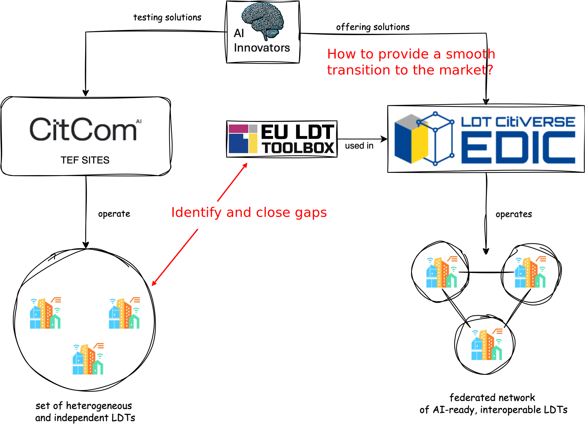
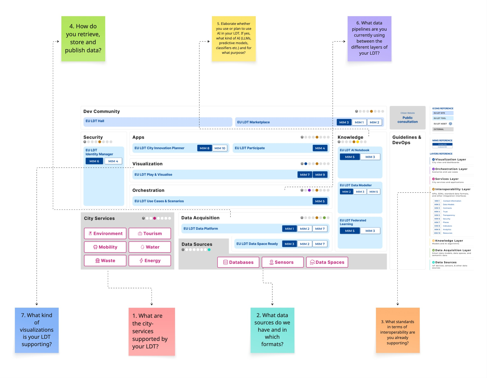

# Towards AI-ready & interoperable LDTs

Local Digital Twins (LDTs) are at the forefront of transforming how cities and communities leverage data and technology to address complex challenges. As the demand for AI-ready and interoperable systems grows, it becomes imperative to establish a unified approach that ensures seamless integration and collaboration across diverse LDT environments. This section introduces the collective efforts and strategic vision aimed at achieving this goal, setting the stage for the technical and strategic objectives outlined below. By fostering interoperability and aligning with open standards, we pave the way for scalable, sustainable, and innovative solutions that benefit both local and European-wide initiatives.

## Strategic Goals
- Assess Cross-Site Interoperability: Evaluate the feasibility and value of enhancing interoperability among LDTs across TEF sites
- Evolve LDTs: Recommend improvements to LDTs and explore common cross-site infrastructure (e.g., data spaces, AI model repositories)
- Define Joint Pilots: Identify and test pilots to validate proposed ideas in real-world scenarios

## Technical Goals
- Aligning with the EU LDT Toolbox, FIWARE and open standards like ETSI NGSI-LD
- Ensuring LDTs can seamlessly integrate AI models by providing structured, standardized, and accessible data
- Develop a “blueprint” for interoperable LDTs across TEF sites
- Identifying and standardizing thematic datasets to enable seamless cross-site data exchange
- Applying MIMs and best practices to ensure scalability and sustainability.

To facilitate collaboration and drive progress towards these goals, we established the LDT Club—a dedicated forum where stakeholders can share insights, align strategies, and collectively address challenges. This collaborative platform serves as a cornerstone for fostering innovation and ensuring that the transition to AI-ready and interoperable LDTs is both inclusive and effective.

Meeting minutes, recordings and further materials related to the LDT Club are available under https://imecinternational.sharepoint.com/:f:/r/sites/Citcom.aiTEF/Shared%20Documents/WP3%20-%20Infrastructure/T3.2/LDT%20Club?csf=1&web=1&e=zyhvcL.

## Scenario: CitCom.AI – EDIC LDT - CitiVerse

The scenario illustrated in the diagram above puts the LDT CitiVerse EDIC and CitCom.AI TEF sites in relation. While the EDIC aims at creating a federated network of Local Digital Twins (LDTs) across Europe, CitCom.AI leverages LDTs to test and integrate AI solutions, fostering innovation in Smart Cities and Communities.\
AI innovators begin by collaborating with CitCom.AI TEF sites, where they can access real-world LDT environments to develop, test, and validate their AI solutions. Ideally, these environments should provide standardized, interoperable data and infrastructure aligned with EU LDT Toolbox guidelines.\
Once solutions are successfully demonstrated within CitCom.AI, innovators can leverage the established interoperability and best practices to integrate their solutions into the broader EDIC federated LDT network. This pathway ensures that innovations are not only tested in realistic scenarios but are also ready for seamless adoption and scaling across multiple European cities and communities through the EDIC framework.\
To ensure interoperability, the CitCom.AI LDTs, currently a set of heterogeneous and independent systems, should adopt common standards and frameworks outlined in the EU LDT Toolbox. This includes aligning data models, APIs, and communication protocols to enable seamless integration and collaboration across the EDIC federated LDT network.\
Conducting a gap analysis between CitCom.AI LDTs and the EU LDT Toolbox is crucial to identify areas where alignment is needed. This analysis will help pinpoint discrepancies in data models, APIs, and communication protocols, ensuring that AI solutions tested within CitComAI can transition seamlessly to the EDIC federated network. By addressing these gaps, the pathway for AI innovators to scale their solutions across Europe becomes more efficient and less fragmented.\

## How to start with a gap analysis?

The diagram above illustrates the different layers and tools of the EU LDT Toolbox. Each sticky note at the border of the  diagram links a question about your existing LDT with the relevant layer of the EU LDT Toolbox. Answering these questions provides a structured starting point for further elaboration of a gap analysis, helping to identify areas where alignment with the toolbox is needed.

Starting from the bottom to the top layer, the following questions help structure your gap analysis. Each question is paired with its rationale and expected outcome to guide your assessment:

### 1. Question: What are the city-services supported by your LDT?
**Related layer:** Services\
**Why it matters:** It clarifies which service domains (e.g. mobility, energy, waste) each LDT addresses. This helps identify overlaps, complementary areas, and opportunities for aligning use-case-specific models or indicators. \
**Outcome:** Provides a shared view of functional scope across partners, guiding discussions on domain priorities and potential areas for interoperability or joint development.
 
### 2. Question: What data sources do we have and in which formats?\
**Related layer:** Data Sources \
**Why it matters:** Data heterogeneity is a major barrier to interoperability. Knowing the sources (IoT, legacy systems, GIS, etc.) helps assess compatibility. \
**Outcome:** Supports data model alignment, semantic mapping, and standardization efforts across partners.

### 3. Question: What standards in terms of interoperability are you already supporting?  
**Related layer:** Interoperability Layer  
**Why it matters:** This directly touches on technical alignment: APIs, data standards (e.g., NGSI-LD, OGC), middleware, ontologies, etc.  
**Outcome:** Helps to map the interoperability landscape, uncover gaps, and guide toward converging on shared mechanisms (e.g., FIWARE, IDS, GAIA-X standards).

### 4. Question: How do you retrieve, store and publish data?  
**Related layer:** Data Acquisition \
**Why it matters:** Covers the full data lifecycle and reveals differences in how data is made accessible, which impacts interoperability and reuse.  
**Outcome:** Identifies common patterns and gaps in data handling to support alignment on shared access and publishing approaches.

### 5. Question: Elaborate whether you use or plan to use AI in your LDT. If yes, what kind of AI (LLMs, predictive models, classifiers etc.) and for what purpose?  
**Related layer:** Knowledge  
**Why it matters:** Captures both current capabilities and future intentions, helping assess AI maturity and identify relevant tools, methods, and gaps.  
**Outcome:** Maps the AI landscape across LDTs, revealing opportunities for reuse, collaboration, or shared infrastructure for AI integration.

### 6. Question: What data pipelines are you currently using between the different layers of your LDT?  
**Related layer:** Orchestration  
**Why it matters:** It clarifies which service domains each LDT targets, helping identify overlaps, complementary focus areas, and opportunities for aligning use-case-specific models or indicators.  
**Outcome:** Provides a shared view of functional scope across partners, guiding discussions on domain priorities and potential areas for interoperability or joint development.

### 7. Question: What kind of visualizations is your LDT supporting? 
**Related layer:** Visualization  
**Why it matters:** Visualizations are a key interface between the Local Digital Twin (LDT) and its users.  
**Outcome:** It gives a clear overview of current visualization capabilities and technologies (Kepler.gl, PowerBI, Grafana etc.).

## Resulting Examples
The following sections provide two examples where the template has been applied.

### Luxembourg Institute of Science and Technology / Luxembourg TEF - LDT For Electromobility​

**Question:**\
What are the city-services supported by your LDT?\
**Answer:**\
Our LDT is meant to enable city planners & mobility operators to monitor and optimise EV related infrastructure. It is supposed to empower decision-making through predictive analytics, scenario testing ("What-if scenarios"), and  monitoring, fostering greener and smarter urban​ development.  

**Question:** \
What data sources do we have and in which formats?\
**Anwer:**\
We  deal with data about energy consumption and production. The data comes from simulation engines, REST APIs, or historical datasets. The data format is mainly JSON.  

**Question:**\
What standards in terms of  interoperability are you already supporting?\
**Answer:**\
Our architecture is based on custom micro services and Azure components. Communication happens mainly via REST APIs (documented using OpenAPI 3.0) or Azure Event Grid. Since we are relying on Azure DT  our digital twin model is based on DTDL v3. For any geospatial data we rely on GeoJSON.  

**Question**\
How do you retrieve, store and publish data?\
**Answer:**\
Entities and their relationships are stored in a Neo4j graph database, while telemetry data is kept as timeseries in InfluxDB. We also use Minio (S3) as a kind of staging storage. However, this data is not yet published.

**Question:**\
Elaborate whether you use or plan to use AI in your LDT. If yes, what kind of AI (LLMs, predictive models, classifiers etc.) and for what purpose?  
**Answer:**\
A user can define scenario/new entities parameters to trigger the generation of synthetic (simulations) or forecasting (deep learning) data. Several purposes: what-if scenarios, forecasting, anomalies detection etc. Results stored in MinIO or InfluxDB and then used for new graphs/entities.  

**Questions:**\
What data pipelines are you currently using between the different layers of your LDT?\
**Answer:**\
We have various data pipelines that transform e.g. source data into graph entities and telemetry. Those pipelines are YAML declarations, interpreter and executed by RedPanda Connect (formerly benthos). A dedicated micro service allows to us orchestrate such pipelines.  

**Question:**\
What kind of visualizations is your LDT supporting?\
**Answer:**\
All visualizations are integrated in a single LDT front-end. A mapbox based visualization shows the relevant entities (buildings with PVs, charging stations and POIs)  on a geographical map. Chart.js based graphs are built according to city's needs, they can be grouped into a dashboard. Separation of real/historical telemetries and generated one.  

### Aarhus City Lab / Denmark TEF - BIPED Digital Twin​

**Question:** What are the city-services supported by your LDT?\
**Answer:**\
The BIPED LDT is designed to support city services primarily focused on enabling Positive
Energy Districts (PEDs) and enhancing urban sustainability:
- PED Planning and Development: The digital twin aims to assist city governments,
decision-makers, and local communities in Brabrand/Aarhus in making informed
decisions towards PED planning. It provides a holistic view of PED development,
encompassing energy, mobility, and cross-sectoral properties. (D1.1 sec 3 and D1.3
sec 3.3)
- Climate Goal Acceleration: A core objective is to leverage urban data, including soft
data, to accelerate the achievement of local climate goals within Brabrand. (D1.1 sec 6)
- Public Participation: The LDT seeks to enhance public participation in achieving
positive energy targets by providing access to tools and information. (D1.1 sec 3)
- Energy Management: The integration of an "Energy District Heating Load Forecasting
Model" indicates support for services related to predicting and managing district
heating loads. (D2.2 table 3)
- Mobility and Traffic Management: The LDT supports services related to traffic flow
and environmental impact analysis through integrated "Macroscopic Traffic Modelling"
and its associated energy and environmental impacts modeling. (D2.2 table 3)
Besides these defined city-services BiPED also has achieved to promote Open Data and
investigated how open data can bring secondary value. Also a hope for BiPED is that it can
leverage the agenda for local data management in Aarhus Municipality.

**Question:** \
What data sources do we have and in which formats?\
**Answer:**\
BIPED utilizes a variety of data sources in different formats:
- Hard and Soft Data: This includes sensor data, IoT data, energy
consumption/production data ("hard data"), and information gathered from workshops
and citizen engagement activities ("soft data"). (D1.3 sec 3.3)
- Environmental Data: Environmental noise measurements are collected at a sensor
level in CSV, TXT, and XML formats. Environmental air quality model continuous spatial
data is also used. (D1.3 sec 3.3)
- Energy Data: Data is obtained from the Center Denmark Energy Platform. (D1.3 sec
3.3)
- Mobility Data: Mobility data comes from Road Twin Software. Traffic data is derived
from OpenStreetMap and is accessible in a schema compatible with the INSPIRE
Transport Network. TomTom Traffic Stats data is also utilized for visualizations. D1.3
sec 3.3, D2.1 annex 2, D 2.2 table 3)
- Geographic and Urban Data: This encompasses geographic data, building data,
sensor data, and IoT data. Open Data from the Aarhus open data portal is a source, as
are INSPIRE Geoportal Priority Datasets. (D1.3 sec 3.3, D2.1 annex 2)
- Energy and weather data: Energy consumptions and local weather data from
Kredsløb. Weather forecasts and observations from the Danish meteorological
Institute. Historical weather forecasts from the Norwegian meteorological institute.

Full list:
https://docs.google.com/spreadsheets/d/1dpK9yo6ZPDXqMnP3U0ce4DHcQ6XJq2AIpIWSks4Uk38/edit?gid=185146452#gid=185146452

**Question:** \
What standards in terms of  interoperability are you already supporting?\
**Answer:**\
BIPED places a strong emphasis on interoperability to ensure scalable and sustainable
solutions:
- Minimum Interoperability Standards (MIMs): The project aims to foster an open
technical and policy environment by supporting MIMs to drive and scale sustainable
change (D1.1 sec 3 and D1.3 sec 4).
- Open Standards: The DKSR OUP, which forms the technical core of the digital twin, is
built upon common data models and open standards, including (D1.3 sec 3.6):
    - OGC API Standards.
    - IS O/IEC standards.
    - IT U-T standards.
    - W3C standards.
    - DCAT-AP
- OGC API Processes: There is a general agreement on using the OGC API Processes
standard, which provides guidelines for designing model APIs. This has facilitated the
integration of models, such as the Traffic Model from Road Twin. (D2.1 sec 3.4)
- OpenAPI Compliance: The DKSR Model Coordinator API is described as OpenAPI
compliant, ensuring standardized interaction with integrated models (REST APIs)
- Communication Protocols: The digital twin utilizes widely recognized communication
protocols like AMQP, MQTT, and REST, which are key for interoperable data exchange
between different components and systems. (D1.3 sec 3.4 and D2.1 sec 3.2)
- INSPIRE Compatibility: Traffic data is made accessible in a schema compatible with
the INSPIRE Transport Network, further ensuring interoperability within a broader
European framework. (D2.1 annex 2)

**Question:** \
Elaborate whether you use or plan to use AI in your LDT. If yes, what kind of AI (LLMs, predictive models, classifiers etc.) and for what purpose?\
**Answer:**\
Yes, BIPED explicitly plans to use Artificial Intelligence (AI) in its Local Digital Twin (LDT). The
project envisions "Future-Ready Intelligent Twins" that will leverage AI to:
- Learn and make real-time accurate insights and predictions.
- Accurately align real-time operational decisions with longer-term policy.
BiPED considers the definition of AI as stated in the AI Watch – determining Artificial
Intelligence 2.0 by the European Comission.
While specific types of AI like LLMs or classifiers are not explicitly detailed, the focus on
"predictions" strongly indicates the use of predictive models. Forecast models are the
primary AI models in BiPED currently.
The project also considers AI from a regulatory perspective, referencing the "AI Act" in its Data
Management Plan, suggesting a structured approach to AI integration.

**Question:** \
What data pipelines are you currently using between the different layers of your LDT?\
**Answer:**\
The BIPED Digital Twin's architecture involves several components that interact to form data
pipelines:
- Architectural Components: The system is composed of back-end components,
including the DKSR OUP Platform, VC Publisher, Center Denmark Energy Platform, and
GLayer Server, interacting with front-end components such as VC Map and
Dashboards. (D2.1 sec 3.1, D1.3 sec 3.4)
- Data Hub and Catalogue: A "Data Hub Civora" and the "BIPED Digital Twin" form a
central hub for data. The Data Catalogue facilitates the import of static data files. (D2.1
sec 3.1 and D1.3 sec 3.6)
- Model Integration and Execution: The Model Coordinator component enables the
integration of models hosted on different platforms via APIs. The "Data Routing API"
manages models and processes by defining inputs, outputs, and endpoint details,
effectively creating a pipeline for executing these models. The first release includes the
integration of an energy model (District Heating Load Forecasting Model) and two
mobility models (Macroscopic Traffic Modelling and Environmental Impacts Modeling).
(D2.2 table 3 and D2.1 sec 3.1)
- Communication Protocols: The system utilizes messaging protocols such as AMQP
and MQTT, and communication via REST APIs and OGC APIs, which are standard for
data exchange and pipeline orchestration. (D1.3 sec 3.3 and D2.1 sec 3.1). Other
datasources are expected in near future, meaning the list of protocols might be
extended.

**Question:** \
What kind of visualizations is your LDT supporting?\
**Answer:**\
The BIPED LDT supports various visualizations to present urban data and model outputs:
- Front-End Components: The LDT utilizes "Dashboards" and a "VC Map" as primary
front-end components for visualization (D2.1 sec 3.4).
- Specific Examples:
    - Traffic Simulation: Visualizations show traffic congestions, often represented
as red line segments. (D2.2 sec 5.2)
    - Solar Potential Analysis: This is visualized using a red-to-green color scale,
where red indicates high potential and green indicates low potential. (D2.2 sec.
5.2)
    - Traffic Speed Dashboard: A GLayer traffic speed dashboard specifically for
Aarhus provides information on average speeds, average travel times, and
sample sizes for selected road segments and times. This dashboard uses
TomTom Traffic Stats data. (D2.2 sec 5.2)
    - Innoconnect daskboard: building occupancy in Aarhus