Configuring Keycloak is essential for managing Verifiable Credentials (VCs) in a Data Space. This document provides an overview of how to set up and use Keycloak for issuing VCs.

## Web access

Keycloak has a web interface that allows you to manage different aspects of the Keycloak server, such as creating realms, clients, and users, as well as issuing verifiable credentials (VCs). Access to the Keycloak web interface is through a web browser, using the URL provided during the deployment of the Keycloak server.

If you deploy this service following the [MVDS instructions in AWS](../../mv_data_space/fiware/consumer.md#step-11-configure-values), the access URL for the Keycloak web interface is: `http://keycloak-consumer.<your_consumer_ip>.nip.io`.

By default, Keycloak is deployed with a preconfigured user `keycloak-admin`. The password for this user is generated during the deployment process. You can get the password by running the following command:

```bash
kubectl get secret -n consumer -o json issuance-secret | jq '.data."keycloak-admin"' -r | base64 --decode
```

## Configuration

From the **Keycloak administration console**, you can setup different parts of the Keycloak server:

- [**Realms**](#realms): Isolated logical grouping of users, roles, and clients. You can create multiple realms to separate different environments or applications.
- [**Clients**](#clients): Clients are applications or services that can authenticate users and request access to resources. In the context of VCs, clients can be providers or consumers that interact with the Data Space.
- [**Users**](#users): Users are the entities that can authenticate and interact with the Keycloak server. Users can be assigned roles and permissions to access specific resources or perform certain actions.

### Realms

From the Keycloak administration console, you can create a new realm by clicking on the `Add Realm` button.

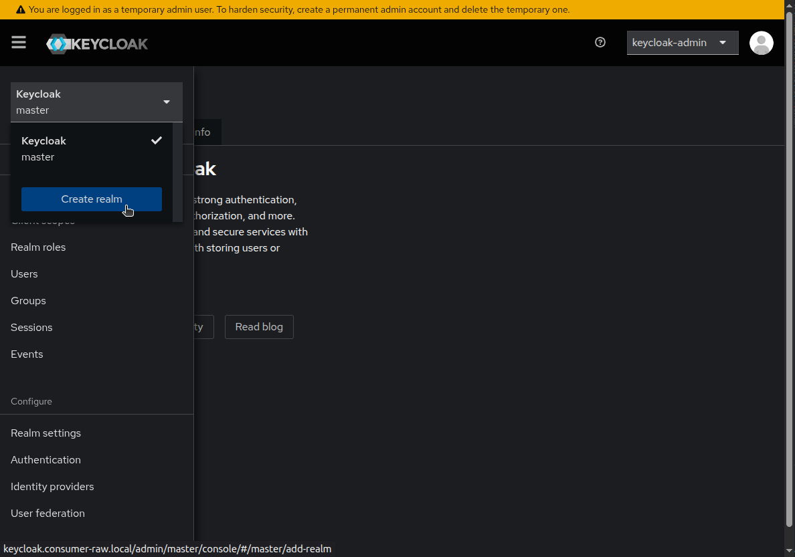

!!! bug

    **Creating a realm from scratch using only the web interface is not currently possible.** You need to import a realm configuration from a JSON file or use the Keycloak Admin REST API.


#### From json file

You can import a realm configuration from a JSON file. This is useful for setting up predefined realms with specific configurations. The realm configuration is provided in the [template.default_config_all-realm.json](./template.default_config_all-realm.json) file. This file contains the necessary configuration for the Keycloak **realm**, including **clients**, **roles**, and **users**.

!!! warning

    Before importing the realm, ensure that:

    - you changed the did:key values in the `template.default_config_all-realm.json` file to match the did:key generated by the did-helper. You can find the did in the did.env file inside the Keycloak container.
    - you changed the pkcs12 password in the `template.default_config_all-realm.json` file to match the one used in cert.pfx generation. You can find the password executing the command in the 'Realm Settings - Key'.

##### Initialize json realm file

```bash
cp template.default_config_all-realm.json default_config_all-realm.json
sed -i "s/{{ISSUER-DID}}/$(kubectl exec keycloak-0 -c keycloak -n consumer-raw -- cat /did-material/did.env | cut -d= -f2 | xargs)/g" default_config_all-realm.json
sed -i "s/{{STORE-PASS}}/$(kubectl get secret -n consumer-raw -o json issuance-secret | jq '.data."store-pass"' -r | base64 --decode)/g" default_config_all-realm.json
```

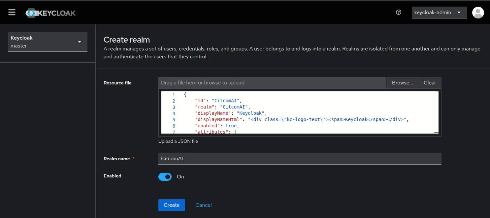

##### Values to change

??? note "Replace with the correct _consumer did-key_ generated by the did-helper:"
    - **attributes** > `issuerDid`:
        ```json
        ...
        "attributes": {
                "frontendUrl": "http://keycloak.consumer-raw.local",
                "issuerDid": "did:key:zDnaeSwnupmLVfbuU6vwpiUBSwgjDuVon1f7u6i31f6v7VTfE"
            }
        ...
        ```
    - **components** > `org.keycloak.keys.KeyProvider` > `config` >`kid`:
        ```json
        ...
        "components": {
            "org.keycloak.keys.KeyProvider": [
                {
                    ...
                    "config": {
                        ...
                        "kid": [
                            "did:key:zDnaeSwnupmLVfbuU6vwpiUBSwgjDuVon1f7u6i31f6v7VTfE"
                        ],
                        ...
                    }
                }
            ]
            ...
        }
        ...
        ```
    - **components** > `org.keycloak.protocol.oid4vc.issuance.signing.VerifiableCredentialsSigningService` > `config` > `keyId` and `issuerDid`:
        ```json
        ...
        "components": {
            ...
            "org.keycloak.protocol.oid4vc.issuance.signing.VerifiableCredentialsSigningService": [
                {
                    ...
                    "config": {
                        "keyId": [
                            "did:key:zDnaeSwnupmLVfbuU6vwpiUBSwgjDuVon1f7u6i31f6v7VTfE"
                        ],
                        ...
                        "issuerDid": [
                            "did:key:zDnaeSwnupmLVfbuU6vwpiUBSwgjDuVon1f7u6i31f6v7VTfE"
                        ],
                        ...
                    }
                }
            ]
            ...
        }
        ...
        ```
??? note "Replace with the correct _provider did-key_ generated by the did-helper:"
    - **clients** > `clientId`:
        ```json
        ...
        "clients": [
            {   
                "clientId": "did:key:zDnaeud7zQitUYp1MxZyRGSuweXfDXGdu6hbYpKvrM6Ws1Eva",
                ...
            }
        ]
        ...
        ```
    - **clients** > `protocolMappers` > `config` > `clientId`:
        ```json
        ...
        "clients": [
            {   
                "protocolMappers": [
                    {
                        "config": {
                            ...
                            "clientId": "did:key:zDnaeud7zQitUYp1MxZyRGSuweXfDXGdu6hbYpKvrM6Ws1Eva",
                            ...
                        }
                    }
                    ...
                ],
                ...
            }
        ]
        ...
        ```
    - **roles** > `client`:
        ```json
        ...
        "roles": {
            ...
            "client": {
                "did:key:zDnaeud7zQitUYp1MxZyRGSuweXfDXGdu6hbYpKvrM6Ws1Eva": [
                    ...
                ]
            }
        },
        ...
        ```
    - **users** > `clientRoles`:
        ```json
        ...
        "users": [
            {
                ...
                "clientRoles": {
                    "did:key:zDnaeud7zQitUYp1MxZyRGSuweXfDXGdu6hbYpKvrM6Ws1Eva": [
                        "OPERATOR"
                    ],
                    ...
                },
                ...
            }
        ],
        ...
        ```


### Clients

To create a new client, go to the `Clients` section in the Keycloak administration console and click on the `Create` button.

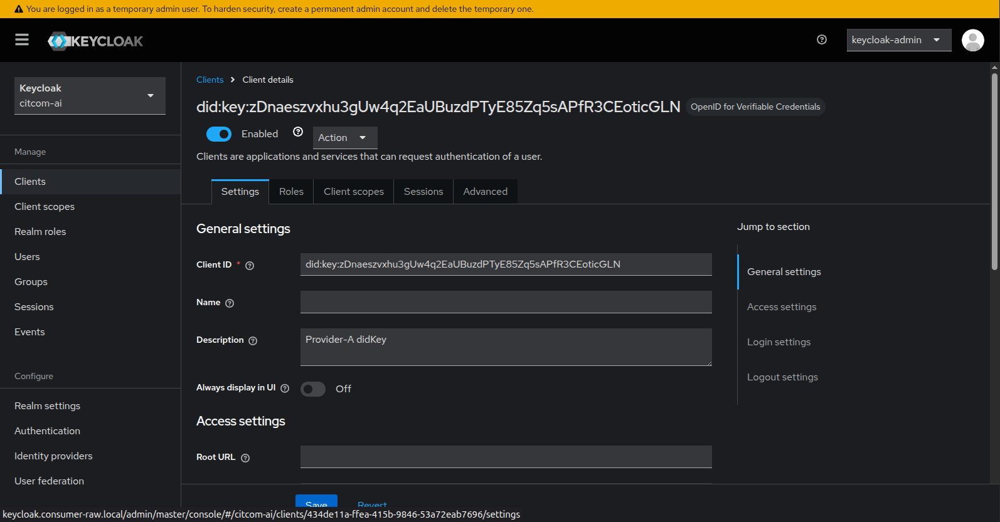

!!! warning

    The DID of the client is the DID of the provider that you want to connect to the Data Space. Also you need to set the roles for the client. The roles are used to authorize the client to access the Data Space.

### Users

To create a new user, go to the `Users` section in the Keycloak administration console and click on the `Add User` button.

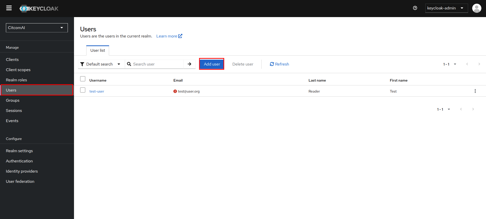

??? note "Step by step:"
    1. Fill in the user details (username, email, etc.).
        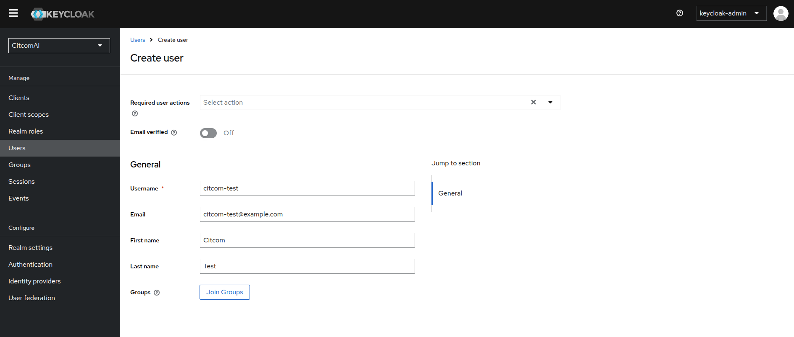
    2. Set a password for the user. You can set a temporal or permanent password.
        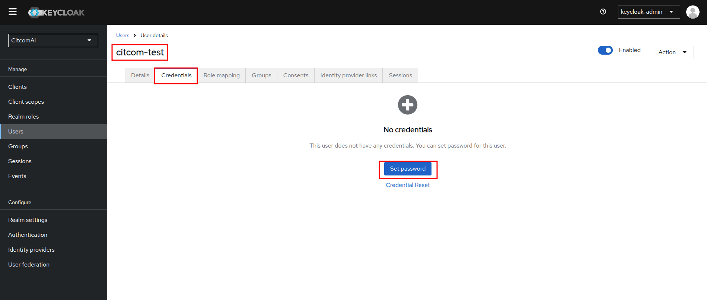
    3. Assign roles to the user.
        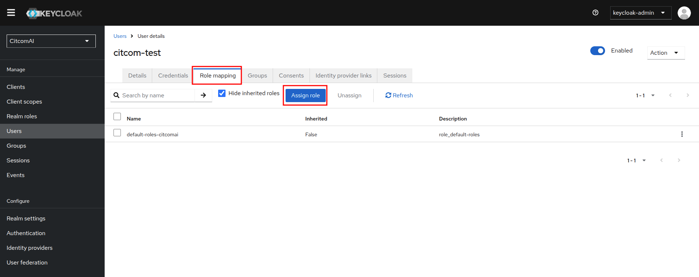
        1. In this case we are filtering roles and selecting OPERATOR role.
            
    4. Save the user.

#### Generate Verifiable Credential for new user
 
##### User Credential

Get an AccessToken from Keycloak:

```bash
export ACCESS_TOKEN=$(curl -s -X POST http://keycloak.consumer-raw.local/realms/CitcomAI/protocol/openid-connect/token \
--header 'Accept: */*' \
--header 'Content-Type: application/x-www-form-urlencoded' \
--data grant_type=password \
--data client_id=admin-cli \
--data username=citcom-test \
--data password=citcom-test \
--data scope='openid'| jq '.access_token' -r); echo ${ACCESS_TOKEN}
```

Get a credential offer uri(for the `user-credential), using the retrieved AccessToken:

```bash
export OFFER_URI=$(curl -s -X GET 'http://keycloak.consumer-raw.local/realms/CitcomAI/protocol/oid4vc/credential-offer-uri?credential_configuration_id=user-credential' --header "Authorization: Bearer ${ACCESS_TOKEN}" | jq '"\(.issuer)\(.nonce)"' -r); echo ${OFFER_URI}
```

Use the offer uri(e.g. the issuer and nonce fields), to retrieve the actual offer:

```bash
export PRE_AUTHORIZED_CODE=$(curl -s -X GET ${OFFER_URI} \
--header "Authorization: Bearer ${ACCESS_TOKEN}" | jq '.grants."urn:ietf:params:oauth:grant-type:pre-authorized_code"."pre-authorized_code"' -r); echo ${PRE_AUTHORIZED_CODE}
```

Exchange the pre-authorized code from the offer with an AccessToken at the authorization server:

```bash
export CREDENTIAL_ACCESS_TOKEN=$(curl -s -X POST http://keycloak.consumer-raw.local/realms/CitcomAI/protocol/openid-connect/token \
--header 'Accept: */*' \
--header 'Content-Type: application/x-www-form-urlencoded' \
--data grant_type=urn:ietf:params:oauth:grant-type:pre-authorized_code \
--data pre-authorized_code=${PRE_AUTHORIZED_CODE} | jq '.access_token' -r); echo ${CREDENTIAL_ACCESS_TOKEN}
```

Use the returned access token to get the actual credential:

```bash
export VERIFIABLE_CREDENTIAL=$(curl -s -X POST http://keycloak.consumer-raw.local/realms/CitcomAI/protocol/oid4vc/credential \
--header 'Accept: */*' \
--header 'Content-Type: application/json' \
--header "Authorization: Bearer ${CREDENTIAL_ACCESS_TOKEN}" \
--data '{"credential_identifier":"user-credential", "format":"jwt_vc"}' | jq '.credential' -r); echo ${VERIFIABLE_CREDENTIAL}
```

You will receive a jwt-encoded credential to be used within the data space.

Decoded jwt credential for citcom-test user example:
```json
{
  "nbf": 1752477064,
  "jti": "urn:uuid:cc974c65-b99c-4a92-9279-b01717e85a0b",
  "iss": "did:key:zDnaeomDNv18fjUmK6pgfL5fpAkE1LyfHo1oJb6yG6Z7Sf9ft",
  "vc": {
    "type": [
      "UserCredential"
    ],
    "issuer": "did:key:zDnaeomDNv18fjUmK6pgfL5fpAkE1LyfHo1oJb6yG6Z7Sf9ft",
    "issuanceDate": 1752477064.948,
    "credentialSubject": {
      "firstName": "Citcom",
      "lastName": "Test",
      "email": "citcom-test@example.com"
    },
    "@context": [
      "https://www.w3.org/2018/credentials/v1",
      "https://www.w3.org/ns/credentials/v1"
    ]
  }
}
```

##### Operator Credential

Get an AccessToken from Keycloak:

```bash
export ACCESS_TOKEN=$(curl -s -X POST http://keycloak.consumer-raw.local/realms/CitcomAI/protocol/openid-connect/token \
--header 'Accept: */*' \
--header 'Content-Type: application/x-www-form-urlencoded' \
--data grant_type=password \
--data client_id=admin-cli \
--data username=citcom-test \
--data password=citcom-test \
--data scope='openid'| jq '.access_token' -r); echo ${ACCESS_TOKEN}
```

Get a credential offer uri(for the `operator-credential), using the retrieved AccessToken:

```bash
export OFFER_URI=$(curl -s -X GET 'http://keycloak.consumer-raw.local/realms/CitcomAI/protocol/oid4vc/credential-offer-uri?credential_configuration_id=operator-credential' --header "Authorization: Bearer ${ACCESS_TOKEN}" | jq '"\(.issuer)\(.nonce)"' -r); echo ${OFFER_URI}
```

Use the offer uri(e.g. the issuer and nonce fields), to retrieve the actual offer:

```bash
export PRE_AUTHORIZED_CODE=$(curl -s -X GET ${OFFER_URI} \
--header "Authorization: Bearer ${ACCESS_TOKEN}" | jq '.grants."urn:ietf:params:oauth:grant-type:pre-authorized_code"."pre-authorized_code"' -r); echo ${PRE_AUTHORIZED_CODE}
```

Exchange the pre-authorized code from the offer with an AccessToken at the authorization server:

```bash
export CREDENTIAL_ACCESS_TOKEN=$(curl -s -X POST http://keycloak.consumer-raw.local/realms/CitcomAI/protocol/openid-connect/token \
--header 'Accept: */*' \
--header 'Content-Type: application/x-www-form-urlencoded' \
--data grant_type=urn:ietf:params:oauth:grant-type:pre-authorized_code \
--data pre-authorized_code=${PRE_AUTHORIZED_CODE} | jq '.access_token' -r); echo ${CREDENTIAL_ACCESS_TOKEN}
```

Use the returned access token to get the actual credential:

```bash
export VERIFIABLE_CREDENTIAL=$(curl -s -X POST http://keycloak.consumer-raw.local/realms/CitcomAI/protocol/oid4vc/credential \
--header 'Accept: */*' \
--header 'Content-Type: application/json' \
--header "Authorization: Bearer ${CREDENTIAL_ACCESS_TOKEN}" \
--data '{"credential_identifier":"operator-credential", "format":"jwt_vc"}' | jq '.credential' -r); echo ${VERIFIABLE_CREDENTIAL}
```

You will receive a jwt-encoded credential to be used within the data space.

Decoded jwt credential for citcom-test user example:

```json
{
  "nbf": 1752560178,
  "jti": "urn:uuid:adfa1e98-28d0-4a6f-8a53-d9c6f0294ca4",
  "iss": "did:key:zDnaeomDNv18fjUmK6pgfL5fpAkE1LyfHo1oJb6yG6Z7Sf9ft",
  "vc": {
    "type": [
      "OperatorCredential"
    ],
    "issuer": "did:key:zDnaeomDNv18fjUmK6pgfL5fpAkE1LyfHo1oJb6yG6Z7Sf9ft",
    "issuanceDate": 1752560178.136,
    "credentialSubject": {
      "firstName": "Citcom",
      "lastName": "Test",
      "roles": [
        {
          "names": [
            "OPERATOR"
          ],
          "target": "did:key:zDnaeud7zQitUYp1MxZyRGSuweXfDXGdu6hbYpKvrM6Ws1Eva"
        }
      ],
      "email": "citcom-test@example.com"
    },
    "@context": [
      "https://www.w3.org/2018/credentials/v1",
      "https://www.w3.org/ns/credentials/v1"
    ]
  }
}
```

##### Register new Provider as client

Each new provider in the data space has to be instantiated in the verifiable credentials issuer (Keycloak) as a `client`.

Currently, it is not possible to fully configure a client for the issuance of Verifiable Credentials via the Keycloak graphical interface. To achieve this, we will leverage the client import functionality and complete the necessary information.

??? note "1. Instantiate the JSON file to be imported from `template.client_import.json`"
    
    ```shell
    cp template.client_import.json client_import.json
    sed -i "s/{{PROVIDER-DID}}/<fillme>/g" client_import.json
    ```

??? note "2. Define the types of Verifiable Credentials to be issued."
    
    ```json
    "attributes": {
      ...
      "vc.verifiable-credential.format": "jwt_vc",
      "vc.verifiable-credential.scope": "VerifiableCredential"
    },
    ```
    In the code snippet above, a type of Verifiable Credential named *VerifiableCredential* is defined.

    Additional credential types can be defined following the same structure:

    ```json
    "vc.operator-credential.format": "jwt_vc",
    "vc.operator-credential.scope": "OperatorCredential"
    ```
    
    The above example defines a credential type named *OperatorCredential*.

??? note "3. Adjust the information to be included in the VC JWT via mappers."
    
    ```json
    {
    ...
    "protocolMappers": [
        {
        "name": "first-name",
        "protocol": "oid4vc",
        "protocolMapper": "oid4vc-user-attribute-mapper",
        "consentRequired": false,
        "config": {
        "subjectProperty": "firstName",
        "userAttribute": "firstName",
        "aggregateAttributes": "false"
        }
        },
        {
        "name": "target-role-mapper",
        "protocol": "oid4vc",
        "protocolMapper": "oid4vc-target-role-mapper",
        "consentRequired": false,
        "config": {
        "subjectProperty": "roles",
        "clientId": "{{PROVIDER-DID}}",
        "supportedCredentialTypes": "VerifiableCredential"
        }
        },
        {
        "name": "context-mapper",
        "protocol": "oid4vc",
        "protocolMapper": "oid4vc-context-mapper",
        "consentRequired": false,
        "config": {
        "context": "https://www.w3.org/2018/credentials/v1",
        "supportedCredentialTypes": "VerifiableCredential"
        }
        }    
    ],
    ...
    }
    ```

    The mappers allow us to configure the information that will be added to the `credentialSubject` of the generated Verifiable Credential.

    In the example provided, the following mappers have been created:
    
    - `first-name`: adds the user's *firstName* field to the `credentialSubject`.
    - `target-role-mapper`: adds the user’s roles for the client with ID `PROVIDER_IR`.
    - `context-mapper`: adds the static context with the specified value.

    For each mapper, a list of `supportedCredentialTypes` is specified, indicating the credential types for which this mapper should be applied.

    Example of the generated `credentialSubject`:

    ```json
    "credentialSubject": {
        "firstName": "Citcom",
        "lastName": "Test",
        "roles": [
        {
            "names": [
            "OPERATOR"
            ],
            "target": "did:key:zDnaeud7zQitUYp1MxZyRGSuweXfDXGdu6hbYpKvrM6Ws1Eva"
        }
        ],
        "email": "citcom-test@example.com"
    }
    ```

??? note "4. Import client into Keycloak."

    Navigate to *Clients* > Click the *Import client* button: 
    
    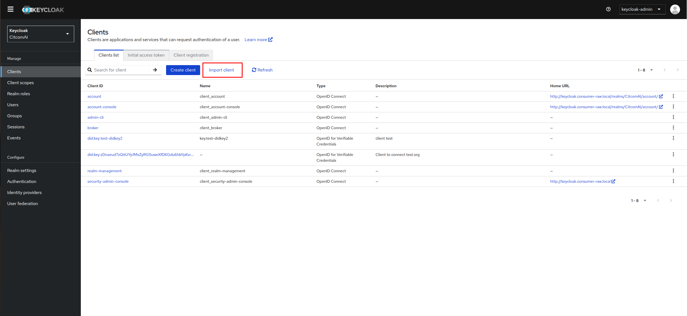

    Click *Browse* > Select the `client_import.json` file:

    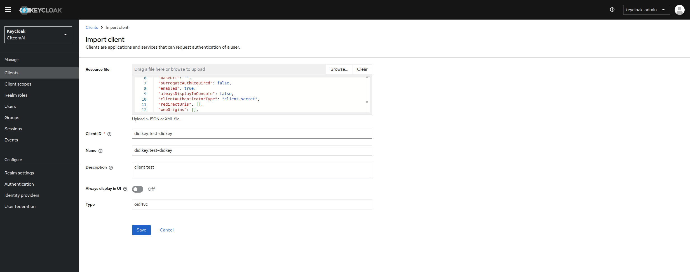

??? note "5. Define *client_roles*."
    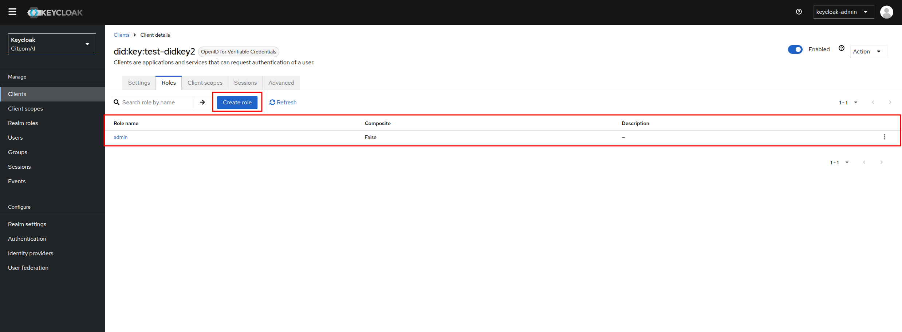

??? note "6. Assign *client_role* to a user."
    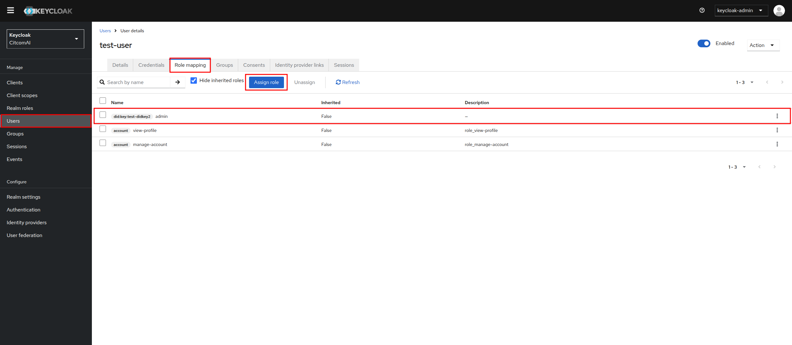

??? note "7. Generate a VerifiableCredential."

    Get an AccessToken from Keycloak:

    ```shell
    export ACCESS_TOKEN=$(curl -s -X POST http://keycloak.consumer-raw.local/realms/CitcomAI/protocol/openid-connect/token \
    --header 'Accept: */*' \
    --header 'Content-Type: application/x-www-form-urlencoded' \
    --data grant_type=password \
    --data client_id=admin-cli \
    --data username=test-user \
    --data password=test \
    --data scope='openid'| jq '.access_token' -r); echo ${ACCESS_TOKEN}
    ```
    Get a credential offer uri(for the `verifiable-credential), using the retrieved AccessToken:

    ```shell
    export OFFER_URI=$(curl -s -X GET 'http://keycloak.consumer-raw.local/realms/CitcomAI/protocol/oid4vc/credential-offer-uri?credential_configuration_id=verifiable-credential' --header "Authorization: Bearer ${ACCESS_TOKEN}" | jq '"\(.issuer)\(.nonce)"' -r); echo ${OFFER_URI}
    ```

    Use the offer uri(e.g. the issuer and nonce fields), to retrieve the actual offer:

    ```shell
    export PRE_AUTHORIZED_CODE=$(curl -s -X GET ${OFFER_URI} \
    --header "Authorization: Bearer ${ACCESS_TOKEN}" | jq '.grants."urn:ietf:params:oauth:grant-type:pre-authorized_code"."pre-authorized_code"' -r); echo ${PRE_AUTHORIZED_CODE}
    ```

    Exchange the pre-authorized code from the offer with an AccessToken at the authorization server:

    ```shell
    export CREDENTIAL_ACCESS_TOKEN=$(curl -s -X POST http://keycloak.consumer-raw.local/realms/CitcomAI/protocol/openid-connect/token \
    --header 'Accept: */*' \
    --header 'Content-Type: application/x-www-form-urlencoded' \
    --data grant_type=urn:ietf:params:oauth:grant-type:pre-authorized_code \
    --data pre-authorized_code=${PRE_AUTHORIZED_CODE} | jq '.access_token' -r); echo ${CREDENTIAL_ACCESS_TOKEN}
    ```

    Use the returned access token to get the actual credential:

    ```shell
    export VERIFIABLE_CREDENTIAL=$(curl -s -X POST http://keycloak.consumer-raw.local/realms/CitcomAI/protocol/oid4vc/credential \
    --header 'Accept: */*' \
    --header 'Content-Type: application/json' \
    --header "Authorization: Bearer ${CREDENTIAL_ACCESS_TOKEN}" \
    --data '{"credential_identifier":"verifiable-credential", "format":"jwt_vc"}' | jq '.credential' -r); echo ${VERIFIABLE_CREDENTIAL}
    ```

    You will receive a jwt-encoded credential to be used within the data space.

    Decoded jwt credential for citcom-test user example:
    ```json
    {
        "nbf": 1752560178,
        "jti": "urn:uuid:adfa1e98-28d0-4a6f-8a53-d9c6f0294ca4",
        "iss": "did:key:zDnaeomDNv18fjUmK6pgfL5fpAkE1LyfHo1oJb6yG6Z7Sf9ft",
        "vc": {
        "type": [
            "OperatorCredential"
        ],
        "issuer": "did:key:zDnaeomDNv18fjUmK6pgfL5fpAkE1LyfHo1oJb6yG6Z7Sf9ft",
        "issuanceDate": 1752560178.136,
        "credentialSubject": {
            "firstName": "Citcom",
            "lastName": "Test",
            "roles": [
            {
                "names": [
                "OPERATOR"
                ],
                "target": "did:key:zDnaeud7zQitUYp1MxZyRGSuweXfDXGdu6hbYpKvrM6Ws1Eva"
            }
            ],
            "email": "citcom-test@example.com"
        },
        "@context": [
            "https://www.w3.org/2018/credentials/v1",
            "https://www.w3.org/ns/credentials/v1"
        ]
        }
    }
    ```