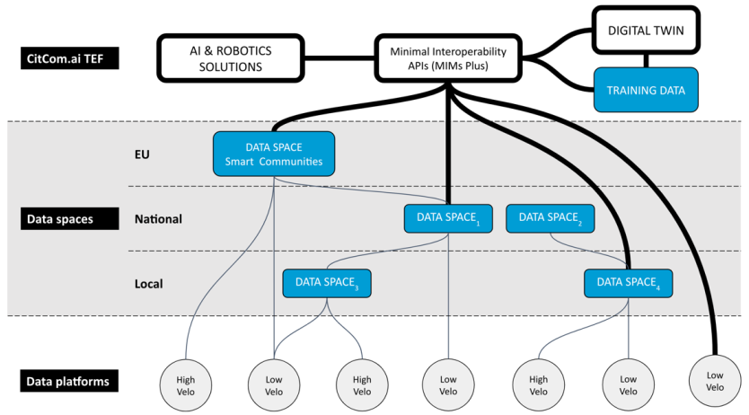
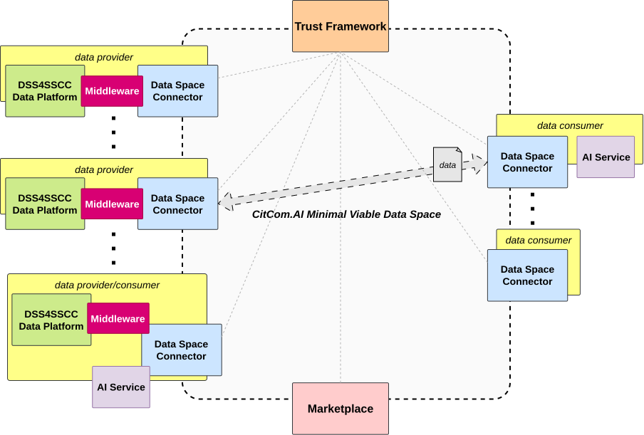

## Overview

Data spaces (DS) refer to structured and managed environments where data from various sources is securely stored, shared, and utilized for AI and robotics applications within smart and sustainable cities. These **data spaces are the project's core technology**, enabling participants to **access** and leverage **high-quality data for testing, experimentation, and validation of AI technologies**.

Data spaces support **interoperability**, ensuring that data from different sources can be combined and used while **complying with regulations** such as the GDPR and other EU directives. They provide the necessary infrastructure for managing data in a way that supports ethical considerations, cybersecurity, and the broader goals of creating a more digital and sustainable urban environment.

??? info "More information"
    - [**Data Space Support Center (DSSC):**](https://dssc.eu/)  
        - [Data Space Definition](https://dssc.eu/space/BVE2/1071251613/Introduction+-+Key+Concepts+of+Data+Spaces#1.-What-is-a-data-space?)
    - [**Data Spaces for Smart Cities (DS4SCC):**](https://www.ds4sscc.eu/)
        - [Interactive portal for building data spaces in Smart Communities](https://inventory.ds4sscc.eu/)

## Minimum Viable Data Space

A Minimum Viable Data Space (MVDS) is a basic configuration of a data space that includes only the essential components required (*Trust Framework* and *Connector*) to ensure interoperability and enable the secure and sovereign exchange of information between organisations. Its minimal approach aims to reduce initial complexity, support technological adoption, and provide a way to test the ecosystem’s functionality before scaling to more comprehensive solutions.

- **Trust Anchor (TA)**: Responsible for managing trust in the data space. It is the manager of the identities of the different elements of the data space and of managing the trust in them. At least one TA shall exist in the data space, managed by the organization in charge of the data space. 

    !!! Tip "More details"
        Overview of open-source trust frameworks: [here](../../documentation/trust_frameworks/index.md)

- **Data Space Connector (DSC)**: Responsible for managing the communication between the different elements of the data space. It oversees managing authentication, authorization and data access control. There must be at least two DSCs, one per organization, to be able to affirm that a data space exists.

    !!! Tip "More details"
        Overview of open-source data spaces connectors: [here](../../documentation/data_space_connectors/index.md)

This type of data space serves as a testing environment that facilitates the validation of data exchange models and a gradual migration from existing systems. Thanks to its streamlined structure, the MVDS is especially well-suited for demonstrations, pilots, or early implementation stages in collaborative settings where data sharing is expected to be trustworthy and controlled.

!!! Note "Interoperability Levels"

    Following the [Interoperability Levels](../interoperability.md#interoperability-levels), the MVDS aims to provide the **minimal set of tools required to progress from** interoperability **level 1 to level 2**.

## CitCom.ai Data Space

Data spaces are pivotal in accelerating innovation by facilitating collaboration among different stakeholders. They offer a secure and compliant framework for data exchange, ensuring that the **AI solutions developed within the project are both reliable and aligned with European standards**.

The following figure provides a high-level overview of a general architecture illustrating how CitCom.ai integrates with current data platforms, and how data spaces will serve as a linking nexus between: nodes, data platforms, and the AI and robotics solutions.

At the bottom of the figure, we see the data platforms that exist in many cities and communities throughout the EU ([Nodes & Countries](../nodes_countries.md)). These data platforms are operated by both public and private sector organisations. Much of these data sets are locked in silos, meaning that it is hard to get the data out of the databases in which they are stored, to be shared with other parties. 

Data spaces are currently being created to counter this siloed EU data landscape. Multiple data space initiatives at local, national and EU level are currently underway. These data spaces will be contributed to by the CitCom.ai TEF sites and leveraged by the AI and robotics solutions that will be brought to the TEF sites by CitCom.ai customers. The solutions will connect to the data spaces through the principles of the Minimal Interoperability Mechanisms (MIMs). 

In addition to leveraging existing and emerging data space initiatives, **CitCom.ai will also deploy its own experimental data space environment**. This tailored infrastructure will interconnect as many project sites as possible, enabling the seamless exchange of data across diverse platforms. By simulating real-world interoperability scenarios, it will serve as a living lab where AI and robotics solutions can be tested in a multi-site setup, ensuring that interoperability and compliance with Minimal Interoperability Mechanisms (MIMs) are validated and enhanced in practice.

