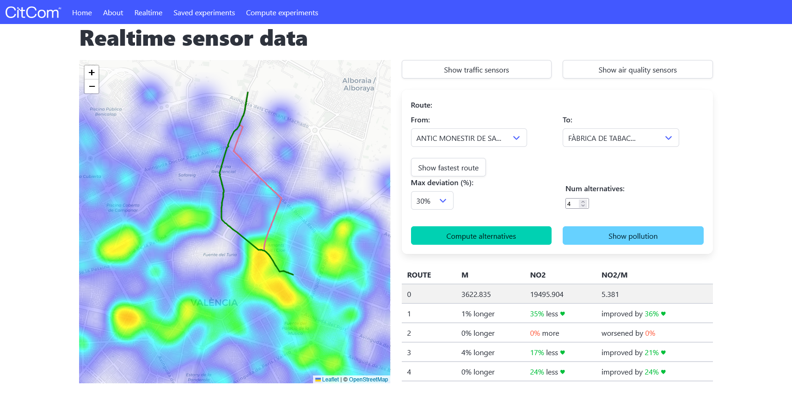

# Healthy Routes Demo
[Repository :simple-github:](https://github.com/CitComAI-Hub/healthy-routes-demo){:target="_blank" .md-button .md-button--primary-light }

<figure markdown>
  { loading=lazy }
</figure>

## Introduction

This project is a **visual demo** of an experiment conducted on pedestrian routes in the city of **Valencia**, with the goal of optimizing routes by considering **pollution caused by traffic**. It also visualises real‑time sensor data (traffic flow, air quality) and pollution heatmaps. Intended as a research/demo repository — not production hardened.

The demo is based on the research presented in the paper:  
[**"Optimizing Pedestrian Paths to Minimize Exposure to Urban Pollution Through Traffic Data Analysis"**](https://doi.org/10.1007/978-3-031-77738-7_17).

## Interoperability

This demo adheres to **Level 1** interoperability as defined by CitCom's [interoperability guidelines](https://citcomai-hub.github.io/getting_started/interoperability/). It is designed to consume data that conforms to the [Smart Data Models](https://smartdatamodels.org/) specifications, specifically the [AirQualityObserved](https://github.com/smart-data-models/dataModel.Environment/tree/master/AirQualityObserved) and [TrafficFlowObserved](https://github.com/smart-data-models/dataModel.Transportation/tree/master/TrafficFlowObserved) models.

> **Note:** This demo has been tailored specifically for the city of Valencia. While it leverages the Smart Data Models specification, there are minor adaptations:
>
> - For `AirQualityObserved` entities, pollutant field names are customized. To ensure correct visualization, set the `.env` variable `AIRQUALITY_POLLUTANT_FIELD` to match the desired pollutant field. This allows you to select which pollutant is displayed on the map.
> - For `TrafficFlowObserved` entities, the `location` attribute is not directly available. Sensor locations are instead referenced from an external `.csv` file.
>
> These adjustments enable the demo to work seamlessly with Valencia's available datasets while maintaining compatibility with Smart Data Models where possible.

## Features
- Map UI with route selection between monuments
- Compute fastest route and alternatives
- Show traffic & air quality sensors (including realtime endpoints)
- Pollution heatmap from precomputed or realtime estimations
- Utilities for spatial queries, kriging interpolation and scoring routes

## Requirements

- Dependencies listed in `requirements.txt`

## Installation

1. Clone the repo:
   ```bash
   git clone https://github.com/CitComAI-Hub/healthy-routes-demo.git
   cd healthy-routes-demo
   ```

2. Create the virtual environment:

   If you don't have the `.venv` virtual environment, you can create it using the following command:

   ```bash
   python -m venv .venv
   ```

3. Activate the virtual environment:

    * On Windows:

        ```bash
        .venv\Scripts\activate
        ```
    * On macOS/Linux:
        ```bash
        source .venv/bin/activate
        ```
    
4. Install dependencies:

    Once the virtual environment is activated, install the required dependencies:
    ```bash
    pip install -r requirements.txt
    ```

## Running the Application

1. Make sure the virtual environment is activated.

2. Run the Flask server with the following command:

    ```bash
    flask --app demo run
    ```

3. The server will start, and you should see the following output:

    ```
    * Serving Flask app 'demo'
    * Debug mode: off
    WARNING: This is a development server. Do not use it in a production deployment. Use a production WSGI server instead.
    * Running on http://127.0.0.1:5000
    ```

4. To view the web interface, open your browser and go to:
http://127.0.0.1:5000
