# Minimal Interoperable AI Service (MIAIS) - Waste Collection 
[Repository :simple-github:](https://github.com/CitComAI-Hub/waste-collection-demo){:target="_blank" .md-button .md-button--primary-light }

<figure markdown>
  { loading=lazy }
</figure>

## Introduction
The **MAIS** is a conceptual and technical demonstration of how AI can be deployed across heterogeneous smart city platforms. Its purpose is to validate AI integration under [different levels of interoperability maturity](./../getting_started/interoperability.md/#interoperability-levels).
Below, we outline how the MAIS, a waste collection route optimization service, can be deployed in environments adhering to **Level 1** and **Level 2** interoperability models.

### Minimal requirements

In Level 0 environments, the MAIS can not be deployed. However, as an example, it includes a Docker instance with all the necessary components to easily simulate a Level 1 environment, including some dummy data.

At Level 1, interoperability is established by adopting **shared data standards and APIs**. The foundational components include **NGSI-LD (MIM1)** as the standard interface for context information exchange and **Smart Data Models (MIM2)** as a shared vocabulary for entities and attributes (e.g., [WasteContainer](https://github.com/smart-data-models/dataModel.WasteManagement/tree/master/WasteContainer), [Vehicle](https://github.com/smart-data-models/dataModel.Transportation/tree/master/Vehicle)).

Level 2 enhances the Level 1 foundation by introducing **secure, governed, and federated data exchange mechanisms through a [data space connector](./../documentation/data_space_connectors/index.md)**.


### Openroute API key
[Openroute](https://openrouteservice.org/) offers a free vehicle routing optimization service based on the [Vroom](https://github.com/VROOM-Project/vroom) project. The MIAIS uses this service to provide and optimal solution. To access the service you will need a valid API key, so go over to [openrouteservice.org](https://openrouteservice.org) and get one; you will need it later. If you want to learn more, the API and parameters specification are explained [on the Vroom repository](https://github.com/VROOM-Project/vroom/blob/master/docs/API.md).

## Running MIAIS locally
As mentioned, a demo example with some dummy data has been provided so partners can quickly test the service without worrying about the interoperability level. Below, you will find step-by-step instructions on deploying the MIAIS:

1. Clone the repository and navigate to its root folder:
```bash
git clone https://github.com/CitComAI-Hub/waste-collection-demo.git && cd waste-collection-demo
```

2. Init git submodules with the following command. This will clone and install a dead simple [ngsi-ld client library](https://github.com/CitComAI-Hub/ngsild-client) in `lib` folder. Please **note that the library is for testing purposes only and lacks most functionality**. However, it quickly allows you to implement your own methods to interact with the context broker.
```bash
git submodule init && git submodule update
```

3. Next, create and run the Orion-LD Docker image. It is necessary to have [Docker](https://www.docker.com/) and [Docker Compose](https://docs.docker.com/compose) installed. This will set-up an Orion-LD broker with a MongoDB database. Check out the [`docker-compose.yaml`](https://github.com/CitComAI-Hub/waste-collection-demo/blob/mvs-orionld/docker-compose.yaml) file for more details. Alternatively, the demo can also be deployed by using a Scorpio NGSI-LD Broker. If you feel more familiar with this case, switch the branch to `mvs-scorpiold` before running `docker compose up`:
```bash
# Optional: Switch to Scorpio NGSI-LD Broker
# git checkout mvs-scorpiold
docker compose up
```

4. Create and activate a Python virtual environment:
```bash
python3 -m venv ./venv && source ./venv/bin/activate
```

5. Install all requirements:
```bash
pip install -r requirements.txt
```

6. Create an `.env` file using `.env.example` as a guide: 
```bash
cp .env.example .env
```

7. Then edit the `.env` file and replace the `OPENROUTESERVICE_API_KEY` value with your own Openroute service API key.
```bash
OPENROUTESERVICE_API_KEY="Replace this string with your Openroute API key"
```

8. After editing the file and saving it, read the .env file:
```bash
source .env
```  

9. Populate the context broker with some fake data by running the following command. This will create some `WasteContainer` and `VehicleModel` entities in the broker:
```bash
python3 upsert_fake_data.py
```

10. Finally, start the server and open [http://127.0.0.1:5000](http://127.0.0.1:5000) in your browser:
```bash
flask --app server run
```

## Running MIAIS in Level 1
As described above, the MIAIS gets the necessary information from the TEF site data platform using NGSI-LD (MIM1) as the standard interface for context information exchange and Smart Data Models (MIM2) as a shared vocabulary for entities and attributes. An intermediary adapter may be required in cases where the city data platform does not comply with the latest NGSI specification. If your current data platform uses the NGSIv2 specification, check the [documentation section](./../documentation/index.md) for more details about using [Lepus](../documentation/data_federation/ngsiv2_to_ld/lepus.md) or [connecting an NGSI-V2 broker with an NGSI-LD broker through subscriptions](../documentation/data_federation/ngsiv2_to_ld/iot_agent.md).

```mermaid
graph LR
  A["**TEF Context Broker**"] ---|NGSI-LD| B["🤖 **AI Service**"];
```

<figure>

<figcaption>Figure 1: MIAIS integration in Level 1</figcaption>
</figure>


If your TEF site meets all minimum requirements, you can proceed with deploying the MIAIS in your city. Follow [previous instructions](#running-miais-locally) to get it up and running (except for the commands aimed at creating the context broker and inserting dummy data). Just remember that you must update the `.env` variables file so they point to the TEF data platform. If everything goes well, the example should work. Of course, some `WasteContainer` and `Vehicle` **entities must be available in your context broker**. Otherwise, use and adapt the `upsert_fake_data.py`script to your needs.

### Authentication
When working with brokers in a production state, authentication is often required. The [`ngsild-client`](https://github.com/CitComAI-Hub/ngsild-client) library included in the example does not come with authentication support. However, it is quite straightforward to extend it to meet authentication requirements. 

As an example, check the following code of the [Valencia TEF site](./../tef/south_connect/valencia.md) implementation, which integrates [authentication for their NGSIv2 context broker](https://github.com/CitComAI-Hub/ngsild-client/blob/master/Authv2.py).

```python
from lib.ngsildclient.Auth import Authv2
from lib.ngsildclient.Client import Client


# Define service & subservice
service = "tef_city"
subservice = "/containers"

# Authenticate
auth = Authv2()
token = auth.get_auth_token_subservice(service, subservice)

# Ngsi-ld broker client
client = Client()

# Fetch WasteContainer entities
context = os.environ.get("WASTECONTAINERS_CONTEXT")
containers = client.get_all_entities_by_type("WasteContainer", context, 100, 0, service, subservice, token).json()
```

Environment variables in `.env` file:

```bash
AUTH_PROTOCOL="https"
ENDPOINT_KEYSTONE="auth.tef.com:15000"
AUTH_USER="xxxxx"
AUTH_PASSWORD="xxxxx"
```

## Running MIAIS in Level 2
At Level 2, deploying the MAIS requires integration with the **data space infrastructure**. The AI service no longer connects directly to raw NGSI-LD endpoints; instead, it accesses data via the standardized interface provided by the connector. This approximation guarantees that all data exchanges are **traceable, governed, and policy-compliant**.

<figure markdown>
  { loading=lazy }
  <figcaption>Figure 2: MIAIS integration at Level 2</figcaption>
</figure>

To illustrate the case (see Figure 2), a simple data space structure is assumed, composed of a **trust anchor, a data space connector in the provider role, and another in the role of consumer**. The data provider and the consumer are **registered in the trust anchor**, establishing a trust relationship. Moreover, the **consumer is registered in the provider's Trusted Issuer List**, which allows the consumer to issue credentials to third parties with permissions to access the provider's data.

In addition, the AI service has a **wallet identity** consisting of a **Decentralized Identifier (DID)** and its associated private key, enabling the service to authenticate itself and sign verifiable credentials. Finally, the AI service must authenticate against the consumer's **Keycloak** identity server to get the corresponding access token.

This authentication process leverages the **OpenID for Verifiable Presentations (OID4VP)** protocol, allowing the AI service to obtain a verifiable credential from the consumer's identity provider and present it as cryptographic proof of authorization. As a wallet, the service generates a verifiable presentation signed with its private key and submits it to the identity server. After successful verification, the service receives an access token, enabling secure and trusted interaction with the provider. For more details about this process, refer to the [Data Space Connectors documentation](./../documentation/data_space_connectors/index.md).


Below, you will find step-by-step instructions on deploying the MIAIS:

1. Clone the repository and navigate to its root folder:
```bash
git clone https://github.com/CitComAI-Hub/waste-collection-demo.git && cd waste-collection-demo
```

2. Switch the branch to `mvds`:
```bash
git checkout mvds
```

3. Prepare wallet-identity:
```bash
mkdir wallet-identity
chmod o+rw wallet-identity
docker run -v $(pwd)/wallet-identity:/cert quay.io/wi_stefan/did-helper:0.1.1
# unsecure, only do that for testing
sudo chmod -R o+rw wallet-identity/private-key.pem
```

4. Create wallet identity secret
```bash
kubectl create secret generic wallet-identity-secret \
    --from-file=did.json=wallet-identity/did.json \
    --from-file=private-key.pem=wallet-identity/private-key.pem \
    -n consumer

# Check
kubectl get secrets -n consumer
kubectl describe secret wallet-identity-secret -n consumer
```

5. Create ORS API key secret
```bash
kubectl create secret generic ors-api-key --from-literal=OPENROUTESERVICE_API_KEY=your_api_key -n consumer
```

6. Create keycloak login secret
```bash
kubectl create secret generic keycloak-credentials \
    --from-literal=KEYCLOAK_USER='test-user' \
    --from-literal=KEYCLOAK_PASSWORD='test' \
    --from-literal=KEYCLOAK_CLIENT_ID='admin-cli' \
    -n consumer

# Check
kubectl get secrets -n consumer
kubectl describe secret keycloak-credentials -n consumer
```

7. Deploy the MIAIS in your Kubernetes cluster:
```bash
kubectl apply -f flask-app.yaml -n consumer
kubectl get pods -n consumer
```

## Extending MIAIS
The Minimal Interoperable AI Service is a starting point; therefore, feel free to explore and edit the project to start building it up on your own.

??? tip "Project structure"
	- `static/`: Frontend folder. 
		- `index.html`: Defines the UI
		- `main.js`: Defines the main logic.
		- `modules/`: Includes entity classes, API rest client, optimization logic, leaflet stuff, and UI functions.
		- `style.css`: Main CSS style sheet.
	- `server.py`:  Sets up the Flask server and exposes the service API.
	- `services/Optimization.py`: Defines the query for Openroute optimization service. 
	- `lib/`: External python libraries.

??? tip "Formulate new delivery/pickup problems"
    We worked with optimizing trucks routes ([`Vehicle`](https://github.com/smart-data-models/dataModel.Transportation/tree/master/Vehicle) entity) to pickup [`WasteContainers`](https://github.com/smart-data-models/dataModel.WasteManagement/tree/master/WasteContainer) that are full (`fillingLevel` attribute). However, these entities can be replaced to formulate new delivery/pickup problems. Visit the [Smart Data Models repositories](https://github.com/smart-data-models) for more entities and decide which attributes are relevant for your problem. To integrate these changes in the project, you should create the corresponding entity classes in `static/modules/` folder, just like [`WasteContainer.js`](https://github.com/CitComAI-Hub/waste-collection-demo/blob/mvs-orionld/static/modules/WasteContainer.js). Take also a look at [`main.js`](https://github.com/CitComAI-Hub/waste-collection-demo/blob/mvs-orionld/static/main.js) and modify it accordingly. 

    Moreover, maybe your situation needs to consider some time restrictions or priorities. Check out the [Openroute service API specification](https://github.com/VROOM-Project/vroom/blob/master/docs/API.md), which is powerful and includes many parameters to fit your optimization needs. To change/add additional query parameters, go over [`Optimization.py`](https://github.com/CitComAI-Hub/waste-collection-demo/blob/mvs-orionld/services/Optimization.py) and [`Optimizer.js`](https://github.com/CitComAI-Hub/waste-collection-demo/blob/mvs-orionld/static/modules/Optimizer.js) files.

## Issues
Did you find any problem? [Create a new issue](https://github.com/CitComAI-Hub/waste-collection-demo/issues/new).

### Track and status of known problems
- [X] Openroute optimization service has a maximum limit of 70 locations. This can be solved by [deploying your own Openroute instance](https://giscience.github.io/openrouteservice/getting-started).
- [ ] Output from MIAIS service should be provided following MIM1 and MIM2 recommendations. Eg: using Smart data models format like ([FleetVehicle](), [FleetVehicleOperation](), [Road]() and [RoadSegment]()).