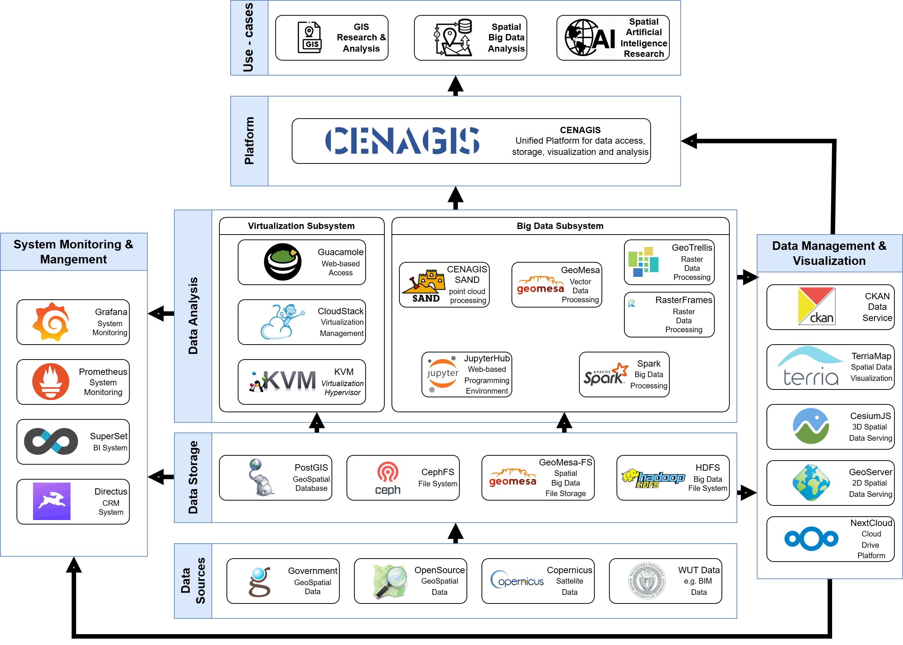

## Overview

The Warsaw TEF site, part of the South Supernode,​ is a computing center dedicated to geospatial data analytics and physical infrastructure for testing devices and applications. The center is based on an advanced IT infrastructure that allows geospatial analysis and satellite calculations.​ Warsaw TEF site is led by Warsaw University of Technology and provides computing infrastructure supporting spatial big data and GeoAI computations, diverse geospatial datasets and expertise and support in spatial big data, smart city, GeoAI, indoor navigation and geospatial analysis.
## Services Offered

The Warsaw TEF Site focuses on the use of spatial data and advanced tools for processing very large spatial datasets and artificial intelligence methods to support smart cities and research in wide range of scientific fields. The Site consists of two facilities. The Warsaw Univesrity of Technology main campus facility is the main node of computing infrastructure providing computing capacity within the virtualisation and big data subsystems. The Józefoslaw centre houses the physical laboratories for testing tools and applications and the development part of the computer cluster.

- **Geospatial data for AI training**: Access to a wide range of geospatial data covering all of Poland for AI training and model validation. The repository follows FAIR principles to ensure data accessibility and interoperability. 

- **Laboratories for testing devices and applications**: Laboratories for testing and certifying measurement instruments used in geoinformation acquisition, as well as for geospatial application testing. 

- **Computing center for geospatial data analytics**: Advanced IT infrastructure for large-scale geospatial analysis and satellite computing, supporting spatial big data applications. 

- **Spatial Big Data research platform**: Jupyter-based research platform that enables country-scale distributed computations on geospatial big data supporting AI models training and development tailored for fast experimenting and deployment. 

## Infrastructure Components

- **Data Platforms**: CENAGIS Catalog data management platform based on [CKAN](https://ckan.org) system provides information on data available within system.
- **Local Digital Twins**: -
- **Specific Hardware**: Server infrastructure consisting of three subsystems: 1. big data subsystem with total resources of 1808 vCPUs, 10.6TB RAM, 1440TB HDD, 60 NVIDIA T4 GPUs 2. virtualization subsystem with total resources of 1092 vCPUs, 4.2TB RAM, 365TB HDD, 2*NVIDIA V100, NVIDIA A100 GPUs 3. development subsystem with total resources of 624 vCPUs, 2.4TB RAM, 346TB HDD
- **IoT Platforms**: - 
- **Visualization platforms**: CENAGIS MapViewer spatial data visualization platform based on [TerriaMap](https://terria.io) allows the visualisation and comparative analysis of a wide variety of spatial datasets. It supports visualisation of very large datasets and supports AI-based extensions of functionality.
- **Other**: -

<!-- <table>
  <tr>
    <th colspan="2" style="text-align: center;">Specifications</th>
  </tr>
  <tr>
    <td><strong>Data Broker<strong></td>
    <td>
      &lt;no_specified> 
      <strong>- API:</strong> &lt;no_specified> 
      <strong>- Version:</strong> &lt;no_specified>
    </td>
  </tr>
  <tr>
    <td><strong>Data Source<strong></td>
    <td>&lt;no_specified></a></td>
  </tr>
  <tr>
    <td><strong>IdM &amp; Auth<strong></td>
    <td>&lt;no_specified></td>
  </tr>
  <tr>
    <td><strong>Data Publication<strong></td>
    <td>&lt;no_specified></td>
  </tr>
</table> -->

### Architecture

Provide a high-level overview of the architecture of the TEF Site, including the key components and technologies used. Include any relevant diagrams or visualizations to help stakeholders understand the infrastructure.

<!-- ### European Data Space for Smart Communities (DS4SSCC) -->

<!-- {{ config.extra.labels.ds4ssc_compliant.yes_comp.data_sources }} {{ config.extra.labels.ds4ssc_compliant.yes_comp.data_broker }} {{ config.extra.labels.ds4ssc_compliant.yes_comp.data_api }} {{ config.extra.labels.ds4ssc_compliant.no_comp.data_idm_auth }} {{ config.extra.labels.ds4ssc_compliant.no_comp.data_publication }}

 -->

## Relevant datasets of the site

Describe the relevant datasets available at the site

- **Dataset_1**: Road network in Poland in form of vector data from Topographic Objects Database (BDOT10k)
- **Dataset_2**: Aerial laser scanning point cloud (LIDAR) for part of the city of Warsaw
- **Dataset_3**: BIM model of Astronomical-Geodetic Observatory in Józefosław - location of part of CENAGIS inrastructure, labolatories and test sites

## Key Stakeholders and Partners

Provide a list of the key stakeholders and partners involved in the TEF Site. Include any academic institutions, industry collaborators, and other stakeholders.

- **Stakeholder 1**: [Warsaw University of Technology](https://eng.pw.edu.pl) - Creator and host of infrastructure
- **Stakeholder 2**: [Opegieka Sp. z o.o.](https://opegieka.pl/home,1,en) - Main partner during system creation process
- **Stakeholder 3**: [Scientific Network for Geospatial Analysis](https://cenagis.edu.pl/en/scientific-network-of-geospatial-analyzes/) - Consortium of nearly 30 research units with the aim of consolidating the geoinformation research program in Poland

## Contact Information

Provide contact details for those responsible for the TEF Site or who can provide more information to collaborators or users.

- **Site Coordinator**: Dariusz Gotlib (email: dariusz.gotlib@pw.edu.pl)
- **Technical Support**: Kamil Choromański (email: kamil.choromanski@pw.edu.pl)
- **General Inquiries**: Agnieszka Wendland (email: agnieszka.wendland@pw.edu.pl)

## Additional Information
The TEF Site offers unique capabilities in geospatial analysis, and it is open to collaboration with other EU projects in the area of big data processing, artificial intelligence and smart cities.
<!-- Any other relevant information that might be useful to collaborators or developers working with the TEF Site, such as specific protocols, access instructions, or unique capabilities.

Example:
The TEF Site offers unique capabilities in [specific field], and it is open to collaboration with other EU projects in the area of [related field]. -->

## Documentation and Resources

- [CENAGIS Official Site](https://cenagis.edu.pl/en/home/)

---

!!! info
    This page is part of the documentation hub for the CitCom.ai project. Please ensure that the information is up-to-date and accurate.
