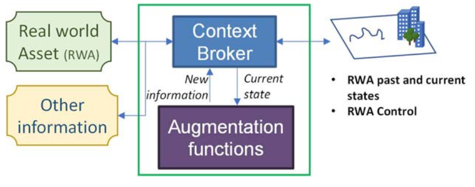
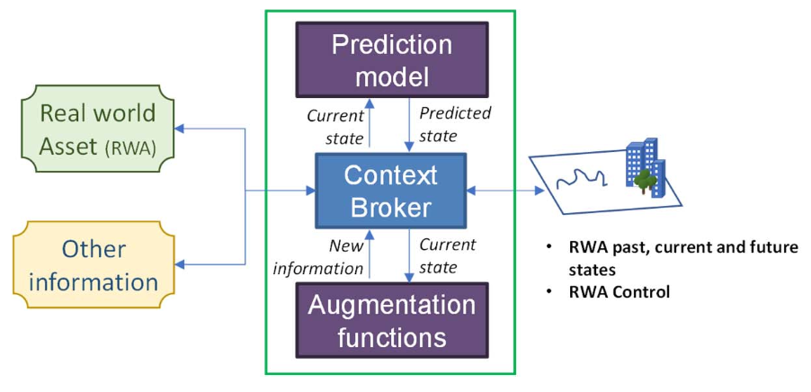

# Local Digital Twin Demonstrator - Bundle

## Overview

The Local Digital Twin Demonstrator Bundle is an application stack designed to provide real-time context management, analytics, and visualization for IoT and other Smart-City data using NGSI-LD & Smart Data Models.

---

## Features

### Real-Time Monitoring
- View live asset status, locations, and entity charts via the Mapbox React app.
- [Access Mapbox React App](http://your-mapbox-react-app-url)

### Historical Dashboards
- Analyze historical data trends and insights using Grafana dashboards.
- [Access Grafana Dashboards](http://your-grafana-url)

### Analytical Tool
- Perform advanced analytics and reporting via Superset.
- [Access Superset Analytics](http://your-superset-url)

---

## Developer Resources

- **[Context Broker API Documentation](https://stellio.readthedocs.io/en/latest/)**: Access the NGSI-LD API documentation and OpenAPI spec for the Stellio Context Broker.
- **[Smart Data Models](https://smartdatamodels.org/)**: Browse the Smart Data Models library for standardized context information schemas.
- **[Source Code Repository](https://git.list.lu/citcom.ai_tef/ldt-demonstrator)**: Explore the source code for the demonstrator and related components.

---

## System Architecture

{ width=50% }

The demonstrator integrates S3 and IoT data via Kafka, processes events through an IoT Agent, and manages context in Stellio Context Broker. All changes are published as Kafka events, feeding analytics and visualization tools.

---

## Development Stack

### Key Technologies

- **[Stellio Context Broker](https://stellio.readthedocs.io/en/latest/)**: NGSI-LD context management for smart cities.
- **[NGSI-LD](https://ngsi-ld.org)**: Next Generation Service Interfaces - Linked Data.
- **[Apache Kafka](https://kafka.apache.org/)**: Distributed event streaming platform.
- **[Redpanda](https://www.redpanda.com/connect)**: Pre-built connectors for event streaming.
- **[Mapbox](https://www.mapbox.com/)**: Geospatial mapping and visualization SDK.
- **[Grafana](https://grafana.com/)**: Open-source dashboards & analytics platform.
- **[Superset](https://superset.apache.org/)**: Open-source analytics & dashboarding framework.

---

## Project Iterations

### Iteration 1: Descriptive Twin
- Presents the current and historical state of the real-world asset, including both static and dynamic characteristics.
- 

### Iteration 2: Predictive Twin
- Builds on the descriptive twin by providing predictions of how the asset may evolve.
- 

### Iteration 3: Prospective Twin
- Enables “what-if” analysis by allowing users to simulate the impact of potential actions on the asset.
- 

---

## References

- Figures and concepts are based on [ETSI GR CIM 017 V1.1.1](https://www.etsi.org/deliver/etsi_gr/CIM/001_099/017/01.01.01_60/gr_CIM017v010101p.pdf): *Context Information Management (CIM); Feasibility of NGSI-LD for Digital Twins*.

---

&copy; 2025 Local Digital Twin Demonstrator. All rights reserved.
